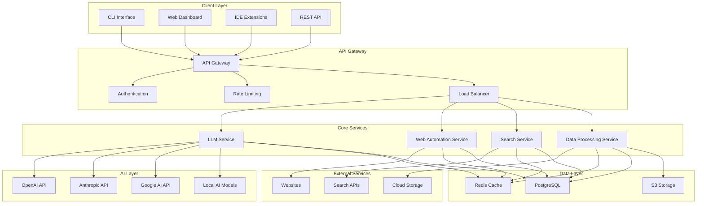
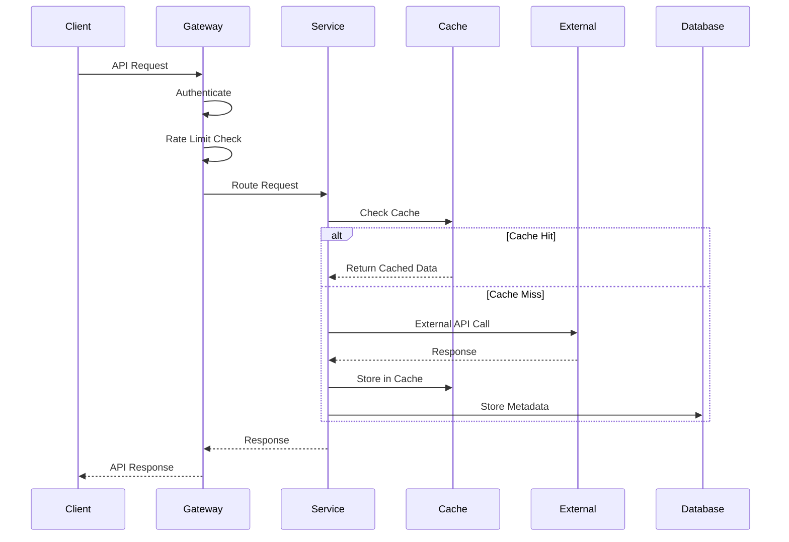
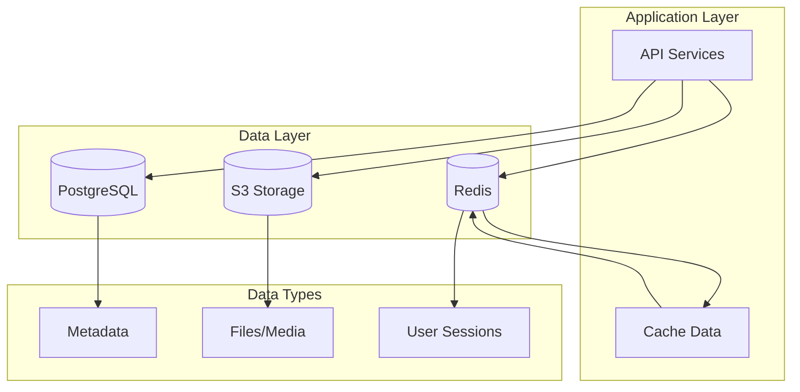
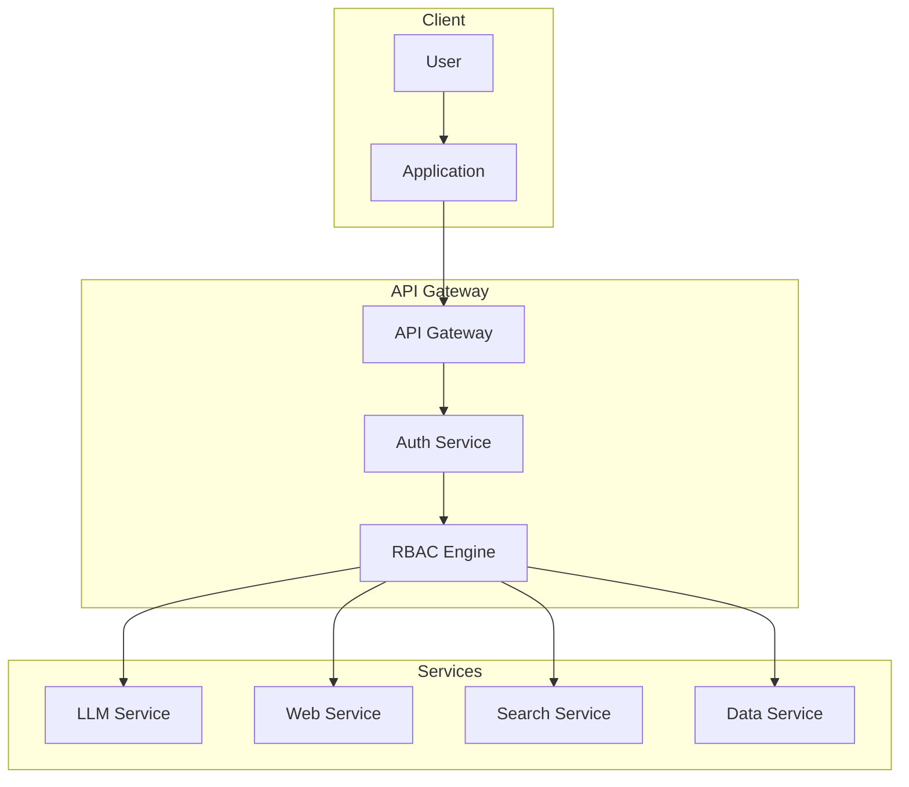
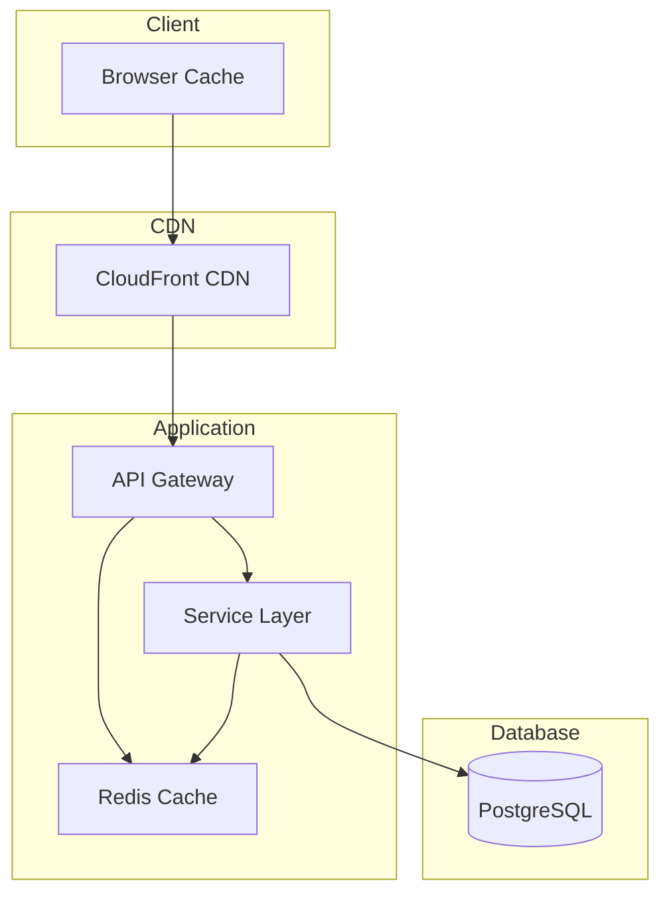
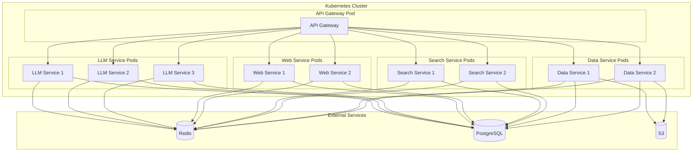
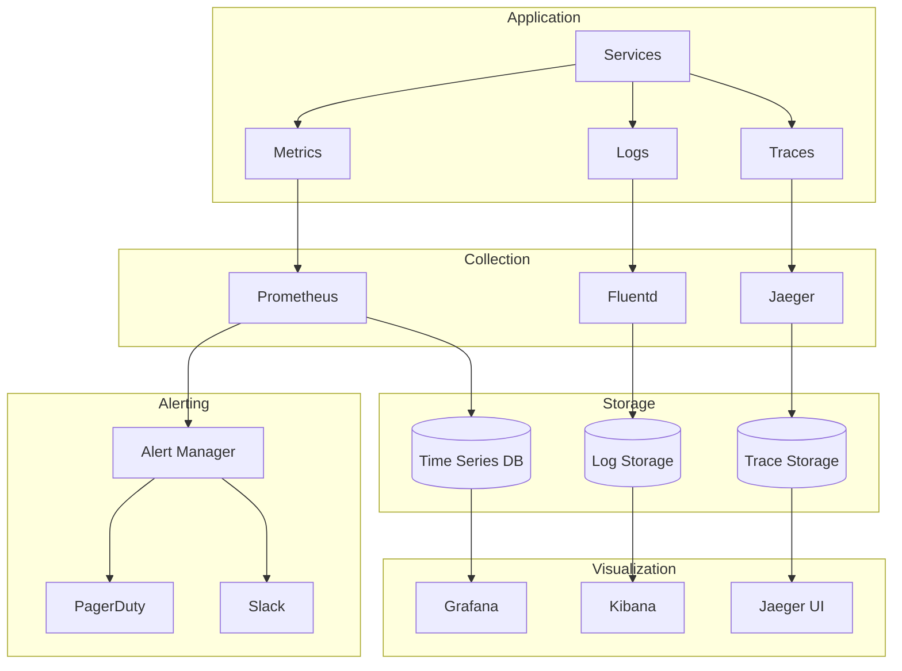
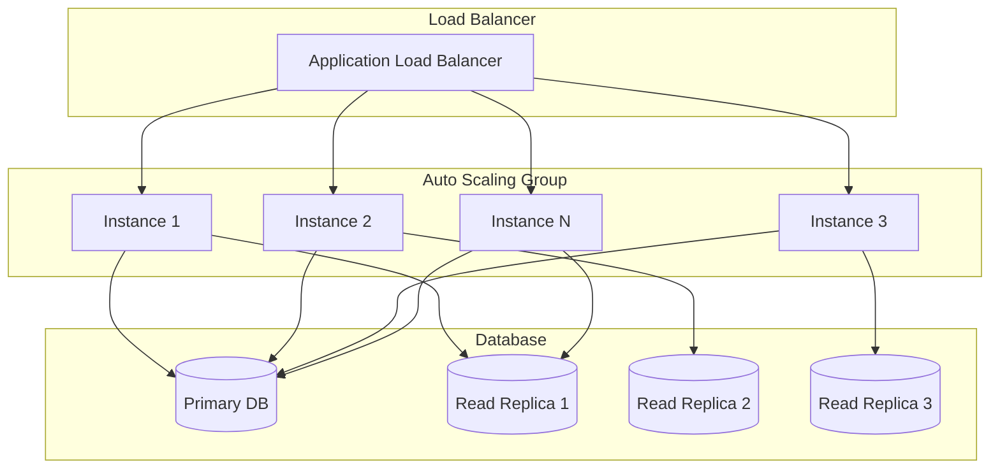

# Devin Cursor Tools Technical Architecture

## Executive Summary

This document outlines the comprehensive technical architecture for the reimplemented Devin Cursor tools suite. The architecture is designed to be modular, scalable, secure, and maintainable, supporting advanced AI integration, web automation, and data processing capabilities.

## Table of Contents

1. [System Overview](#system-overview)
2. [Architecture Principles](#architecture-principles)
3. [Core Components](#core-components)
4. [Data Flow Architecture](#data-flow-architecture)
5. [API Design](#api-design)
6. [Security Architecture](#security-architecture)
7. [Performance Architecture](#performance-architecture)
8. [Deployment Architecture](#deployment-architecture)
9. [Monitoring & Observability](#monitoring--observability)
10. [Scalability Design](#scalability-design)

## System Overview

### High-Level Architecture



### Technology Stack

**Backend:**
- Python 3.11+ (async/await support)
- FastAPI (web framework)
- Pydantic (data validation)
- SQLAlchemy (ORM)
- Alembic (migrations)

**AI & ML:**
- OpenAI API (GPT-4, DALL-E, Whisper)
- Anthropic Claude API
- Google Gemini API
- Hugging Face Transformers
- LangChain (LLM orchestration)

**Web Automation:**
- Playwright (browser automation)
- Selenium (fallback)
- BeautifulSoup4 (HTML parsing)
- Scrapy (web scraping)

**Data Processing:**
- Pandas (data manipulation)
- NumPy (numerical computing)
- Apache Airflow (workflow orchestration)
- Apache Kafka (stream processing)

**Infrastructure:**
- Docker (containerization)
- Kubernetes (orchestration)
- Redis (caching)
- PostgreSQL (database)
- AWS S3 (storage)

## Architecture Principles

### 1. Modular Design
- **Single Responsibility**: Each module has one clear purpose
- **Loose Coupling**: Modules interact through well-defined interfaces
- **High Cohesion**: Related functionality is grouped together
- **Dependency Injection**: Dependencies are injected rather than hardcoded

### 2. Scalability
- **Horizontal Scaling**: Services can scale independently
- **Stateless Design**: Services don't maintain state between requests
- **Caching Strategy**: Multi-level caching for performance
- **Load Balancing**: Distribute load across multiple instances

### 3. Security
- **Defense in Depth**: Multiple layers of security
- **Zero Trust**: Verify every request
- **Encryption**: Data encrypted at rest and in transit
- **Access Control**: Role-based access control (RBAC)

### 4. Reliability
- **Fault Tolerance**: System continues operating despite failures
- **Circuit Breaker**: Prevent cascade failures
- **Retry Logic**: Automatic retry with exponential backoff
- **Health Checks**: Monitor service health

### 5. Observability
- **Structured Logging**: Consistent log format across services
- **Metrics Collection**: Performance and business metrics
- **Distributed Tracing**: Track requests across services
- **Alerting**: Proactive issue detection

## Core Components

### 1. API Gateway

**Purpose:** Single entry point for all client requests

**Responsibilities:**
- Request routing and load balancing
- Authentication and authorization
- Rate limiting and throttling
- Request/response transformation
- CORS handling
- API versioning

**Implementation:**
```python
from fastapi import FastAPI, Depends, HTTPException
from fastapi.middleware.cors import CORSMiddleware
from fastapi.middleware.trustedhost import TrustedHostMiddleware
import uvicorn

class APIGateway:
    def __init__(self, config: GatewayConfig):
        self.app = FastAPI(
            title="Devin Cursor Tools API",
            version="2.0.0",
            description="Advanced AI-powered developer tools"
        )
        self.config = config
        self._setup_middleware()
        self._setup_routes()
    
    def _setup_middleware(self):
        """Set up middleware stack"""
        # CORS
        self.app.add_middleware(
            CORSMiddleware,
            allow_origins=self.config.allowed_origins,
            allow_credentials=True,
            allow_methods=["*"],
            allow_headers=["*"]
        )
        
        # Trusted hosts
        self.app.add_middleware(
            TrustedHostMiddleware,
            allowed_hosts=self.config.trusted_hosts
        )
        
        # Rate limiting
        self.app.add_middleware(RateLimitMiddleware)
        
        # Authentication
        self.app.add_middleware(AuthMiddleware)
    
    def _setup_routes(self):
        """Set up API routes"""
        # Health check
        @self.app.get("/health")
        async def health_check():
            return {"status": "healthy", "timestamp": time.time()}
        
        # API routes
        self.app.include_router(llm_router, prefix="/api/v1/llm")
        self.app.include_router(web_router, prefix="/api/v1/web")
        self.app.include_router(search_router, prefix="/api/v1/search")
        self.app.include_router(data_router, prefix="/api/v1/data")
```

### 2. LLM Service

**Purpose:** Centralized AI/LLM operations

**Responsibilities:**
- Multi-provider LLM integration
- Conversation management
- Token counting and cost tracking
- Response caching
- Rate limiting per provider
- Streaming support

**Architecture:**
```python
class LLMService:
    def __init__(self, config: LLMConfig):
        self.config = config
        self.providers = self._initialize_providers()
        self.conversation_manager = ConversationManager()
        self.cache = LLMCache()
        self.rate_limiter = RateLimiter()
        self.cost_tracker = CostTracker()
    
    async def complete(
        self, 
        request: LLMRequest
    ) -> LLMResponse:
        """Complete LLM request"""
        # Validate request
        await self._validate_request(request)
        
        # Check cache
        cache_key = self._get_cache_key(request)
        cached_response = await self.cache.get(cache_key)
        if cached_response:
            return cached_response
        
        # Rate limiting
        await self.rate_limiter.wait(request.provider)
        
        # Get provider
        provider = self.providers[request.provider]
        
        # Execute request
        response = await provider.complete(request)
        
        # Track costs
        await self.cost_tracker.track(request.provider, response.tokens_used)
        
        # Cache response
        await self.cache.set(cache_key, response)
        
        return response
```

### 3. Web Automation Service

**Purpose:** Web scraping and automation

**Responsibilities:**
- Browser automation with Playwright
- Screenshot capture and PDF generation
- Form interaction and submission
- JavaScript execution
- Anti-detection measures
- Proxy management

**Architecture:**
```python
class WebAutomationService:
    def __init__(self, config: WebConfig):
        self.config = config
        self.browser_pool = BrowserPool(config.browser_pool_size)
        self.proxy_manager = ProxyManager()
        self.captcha_solver = CaptchaSolver()
        self.data_extractor = DataExtractor()
    
    async def capture_screenshot(
        self, 
        request: ScreenshotRequest
    ) -> ScreenshotResponse:
        """Capture screenshot with device simulation"""
        browser = await self.browser_pool.acquire()
        
        try:
            page = await browser.new_page()
            
            # Set device context
            await page.set_viewport_size(request.device.viewport)
            await page.set_extra_http_headers({
                "User-Agent": request.device.user_agent
            })
            
            # Navigate to URL
            await page.goto(request.url, wait_until="networkidle")
            
            # Capture screenshot
            screenshot_data = await page.screenshot(
                full_page=request.full_page,
                type="png"
            )
            
            return ScreenshotResponse(
                data=screenshot_data,
                metadata=ScreenshotMetadata(
                    url=request.url,
                    device=request.device.name,
                    timestamp=time.time()
                )
            )
            
        finally:
            await self.browser_pool.release(browser)
```

### 4. Search Service

**Purpose:** Multi-provider search capabilities

**Responsibilities:**
- Multiple search provider integration
- Result aggregation and deduplication
- Search result ranking
- Search analytics
- Caching and rate limiting

**Architecture:**
```python
class SearchService:
    def __init__(self, config: SearchConfig):
        self.config = config
        self.providers = self._initialize_providers()
        self.cache = SearchCache()
        self.ranker = SearchRanker()
        self.analytics = SearchAnalytics()
    
    async def search(
        self, 
        request: SearchRequest
    ) -> SearchResponse:
        """Execute search across multiple providers"""
        # Check cache
        cache_key = self._get_cache_key(request)
        cached_results = await self.cache.get(cache_key)
        if cached_results:
            return cached_results
        
        # Execute searches in parallel
        tasks = []
        for provider in request.providers:
            if provider in self.providers:
                task = self.providers[provider].search(request)
                tasks.append(task)
        
        provider_results = await asyncio.gather(*tasks)
        
        # Aggregate results
        all_results = []
        for results in provider_results:
            all_results.extend(results)
        
        # Deduplicate and rank
        unique_results = self._deduplicate_results(all_results)
        ranked_results = self.ranker.rank(unique_results, request.query)
        
        # Cache results
        response = SearchResponse(results=ranked_results)
        await self.cache.set(cache_key, response)
        
        # Track analytics
        await self.analytics.track_search(request, len(ranked_results))
        
        return response
```

### 5. Data Processing Service

**Purpose:** Data manipulation and analysis

**Responsibilities:**
- Data cleaning and preprocessing
- Data transformation and normalization
- Statistical analysis
- Data visualization
- Machine learning model training
- Data pipeline orchestration

**Architecture:**
```python
class DataProcessingService:
    def __init__(self, config: DataConfig):
        self.config = config
        self.data_cleaner = DataCleaner()
        self.transformer = DataTransformer()
        self.analyzer = DataAnalyzer()
        self.visualizer = DataVisualizer()
        self.ml_trainer = MLTrainer()
    
    async def process_data(
        self, 
        request: DataProcessingRequest
    ) -> DataProcessingResponse:
        """Process data according to request"""
        # Load data
        data = await self._load_data(request.data_source)
        
        # Clean data
        if request.cleaning_rules:
            data = await self.data_cleaner.clean(data, request.cleaning_rules)
        
        # Transform data
        if request.transformations:
            data = await self.transformer.transform(data, request.transformations)
        
        # Analyze data
        if request.analysis_options:
            analysis = await self.analyzer.analyze(data, request.analysis_options)
        else:
            analysis = None
        
        # Generate visualizations
        if request.visualization_options:
            visualizations = await self.visualizer.create_visualizations(
                data, request.visualization_options
            )
        else:
            visualizations = None
        
        return DataProcessingResponse(
            processed_data=data,
            analysis=analysis,
            visualizations=visualizations
        )
```

## Data Flow Architecture

### Request Flow



### Data Storage Architecture



## API Design

### RESTful API Design

**Base URL:** `https://api.devin-cursor-tools.com/v1`

**Authentication:** Bearer Token (JWT)

**Response Format:** JSON

**Error Handling:**
```json
{
  "error": {
    "code": "INVALID_REQUEST",
    "message": "The request is invalid",
    "details": {
      "field": "query",
      "reason": "Query cannot be empty"
    },
    "timestamp": "2025-01-27T10:30:00Z",
    "request_id": "req_123456789"
  }
}
```

### API Endpoints

#### LLM Endpoints

```http
POST /api/v1/llm/complete
Content-Type: application/json
Authorization: Bearer <token>

{
  "provider": "openai",
  "model": "gpt-4o",
  "messages": [
    {
      "role": "user",
      "content": "Hello, world!"
    }
  ],
  "temperature": 0.7,
  "max_tokens": 1000,
  "stream": false
}
```

#### Web Automation Endpoints

```http
POST /api/v1/web/screenshot
Content-Type: application/json
Authorization: Bearer <token>

{
  "url": "https://example.com",
  "device": {
    "name": "iPhone 12 Pro",
    "viewport": {
      "width": 390,
      "height": 844
    }
  },
  "full_page": true,
  "format": "png"
}
```

#### Search Endpoints

```http
POST /api/v1/search/query
Content-Type: application/json
Authorization: Bearer <token>

{
  "query": "artificial intelligence",
  "providers": ["google", "duckduckgo"],
  "filters": {
    "language": "en",
    "region": "us",
    "safe_search": true
  },
  "max_results": 10
}
```

## Security Architecture

### Authentication & Authorization



### Security Measures

1. **Authentication**
   - JWT tokens with short expiration
   - Refresh token mechanism
   - Multi-factor authentication support
   - API key management

2. **Authorization**
   - Role-based access control (RBAC)
   - Resource-level permissions
   - API endpoint protection
   - Rate limiting per user/role

3. **Data Protection**
   - Encryption at rest (AES-256)
   - Encryption in transit (TLS 1.3)
   - PII data masking
   - Secure key management

4. **Input Validation**
   - Request validation with Pydantic
   - SQL injection prevention
   - XSS protection
   - CSRF protection

5. **Network Security**
   - VPC with private subnets
   - Security groups
   - WAF (Web Application Firewall)
   - DDoS protection

## Performance Architecture

### Caching Strategy



### Performance Optimizations

1. **Caching Layers**
   - Browser caching (static assets)
   - CDN caching (global distribution)
   - Redis caching (application data)
   - Database query caching

2. **Database Optimization**
   - Connection pooling
   - Query optimization
   - Indexing strategy
   - Read replicas

3. **Async Processing**
   - Async/await throughout
   - Background task processing
   - Message queues
   - Event-driven architecture

4. **Resource Management**
   - Connection pooling
   - Memory management
   - CPU optimization
   - I/O optimization

## Deployment Architecture

### Container Architecture



### Infrastructure as Code

**Terraform Configuration:**
```hcl
# VPC Configuration
resource "aws_vpc" "devin_cursor_vpc" {
  cidr_block           = "10.0.0.0/16"
  enable_dns_hostnames = true
  enable_dns_support   = true
  
  tags = {
    Name        = "devin-cursor-vpc"
    Environment = var.environment
  }
}

# EKS Cluster
resource "aws_eks_cluster" "devin_cursor_cluster" {
  name     = "devin-cursor-cluster"
  role_arn = aws_iam_role.eks_cluster_role.arn
  version  = "1.28"
  
  vpc_config {
    subnet_ids = aws_subnet.private[*].id
  }
  
  depends_on = [
    aws_iam_role_policy_attachment.eks_cluster_policy,
  ]
}

# RDS Database
resource "aws_db_instance" "devin_cursor_db" {
  identifier = "devin-cursor-db"
  engine     = "postgres"
  engine_version = "15.4"
  instance_class = "db.t3.micro"
  allocated_storage = 20
  storage_type = "gp2"
  
  db_name  = "devin_cursor"
  username = var.db_username
  password = var.db_password
  
  vpc_security_group_ids = [aws_security_group.rds.id]
  db_subnet_group_name   = aws_db_subnet_group.devin_cursor.name
  
  backup_retention_period = 7
  backup_window          = "03:00-04:00"
  maintenance_window     = "sun:04:00-sun:05:00"
  
  skip_final_snapshot = true
}

# ElastiCache Redis
resource "aws_elasticache_replication_group" "devin_cursor_redis" {
  replication_group_id       = "devin-cursor-redis"
  description                = "Redis cluster for Devin Cursor Tools"
  
  node_type                  = "cache.t3.micro"
  port                       = 6379
  parameter_group_name       = "default.redis7"
  
  num_cache_clusters         = 2
  automatic_failover_enabled = true
  multi_az_enabled          = true
  
  subnet_group_name = aws_elasticache_subnet_group.devin_cursor.name
  security_group_ids = [aws_security_group.redis.id]
}
```

## Monitoring & Observability

### Monitoring Stack



### Key Metrics

1. **Application Metrics**
   - Request rate and latency
   - Error rate and types
   - Response time percentiles
   - Throughput metrics

2. **Infrastructure Metrics**
   - CPU and memory usage
   - Disk I/O and network I/O
   - Database performance
   - Cache hit rates

3. **Business Metrics**
   - User activity and engagement
   - API usage patterns
   - Cost per request
   - Feature adoption rates

## Scalability Design

### Horizontal Scaling



### Scaling Strategies

1. **Auto Scaling**
   - CPU-based scaling
   - Memory-based scaling
   - Custom metrics scaling
   - Predictive scaling

2. **Database Scaling**
   - Read replicas
   - Sharding strategy
   - Connection pooling
   - Query optimization

3. **Caching Scaling**
   - Redis clustering
   - Cache partitioning
   - Cache warming
   - Cache invalidation

4. **CDN Scaling**
   - Global distribution
   - Edge caching
   - Dynamic content caching
   - Image optimization

## Conclusion

This technical architecture provides a comprehensive foundation for the Devin Cursor tools reimplementation. The modular design ensures maintainability, the security architecture protects against threats, the performance optimizations ensure scalability, and the monitoring stack provides observability.

The architecture is designed to evolve with changing requirements while maintaining high availability, security, and performance standards. Each component is independently scalable and can be updated without affecting the entire system.

The implementation follows industry best practices and modern cloud-native patterns, ensuring the system is robust, maintainable, and future-proof.

